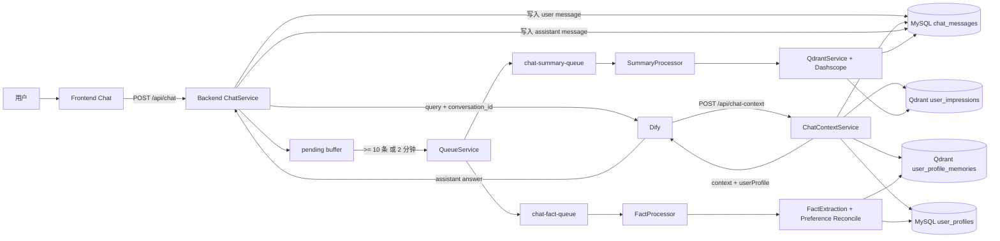
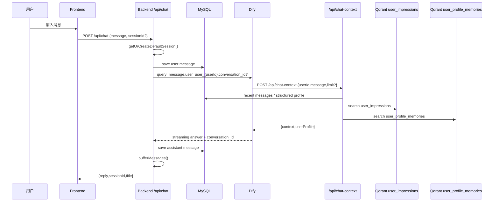
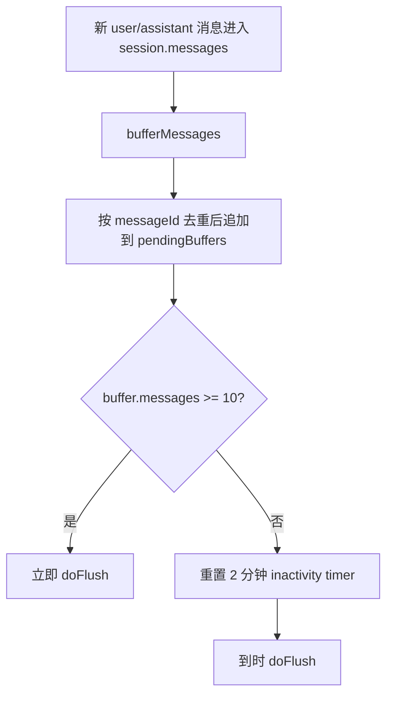
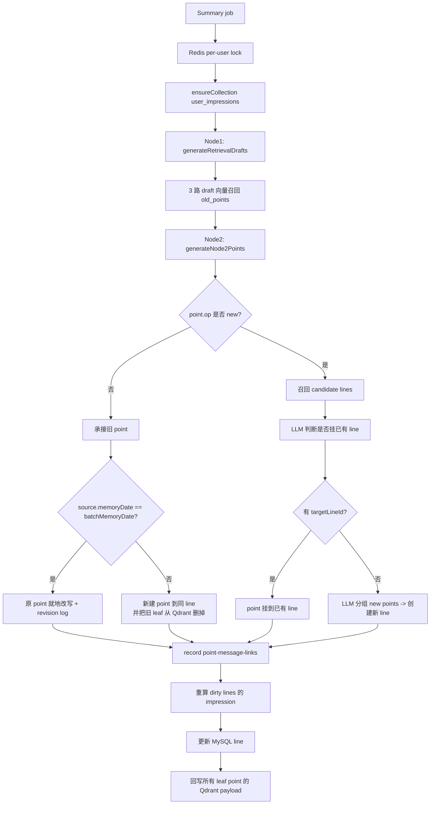

# 项目完整数据流

以当前代码实现为准，不以历史设计稿为准。

关键代码：
- `frontend/src/pages/Chat.tsx`
- `backend/src/chat/chat.controller.ts`
- `backend/src/chat/chat.service.ts`
- `backend/src/chat/chat-context.service.ts`
- `backend/src/queue/queue.service.ts`
- `worker/src/processor/summary.processor.ts`
- `worker/src/services/qdrant.service.ts`
- `worker/src/services/dashscope.service.ts`
- `worker/src/processor/fact.processor.ts`
- `worker/src/services/fact-extraction.service.ts`
- `worker/src/services/user-profile-memory.service.ts`

## 1. 总览



## 2. 在线聊天主链



### 实际步骤

1. 前端发送 `POST /api/chat`，默认只使用一个 default session；如果传了非默认 session，后端直接 `403`。
2. 后端先写入用户消息到 `chat_messages`。
3. 后端调用 Dify，实际 payload 是：

```json
{
  "inputs": {},
  "query": "用户当前输入",
  "user": "user_{userId}",
  "response_mode": "streaming",
  "conversation_id": "有则传"
}
```

4. Dify 在生成回复前，自己调用 `POST /api/chat-context` 取同步记忆上下文。
5. 后端从 Dify 的 SSE 流里累计 `event === "message"` 的 `answer`，并拿到 `conversation_id`。
6. 后端写入 assistant 消息，更新 session，进入本地 pending buffer。

### Buffer / Flush



这里要和后面的“任务 payload 拼接”分开看：
- 缓存阶段只关心 `10 条` 或 `2 分钟`
- “固定补最近 15 条历史”发生在 flush 之后构造 `summary` 任务 payload 时，不是缓存上限

### Flush 时的拼接

```mermaid
flowchart TD
  A[本次 newMessages] --> D[查 DB 最近 24h 内本 session 的 15 + newMessages.length 条消息 DESC]
  D --> E[转成 historyMessages 并 reverse 成 ASC]
  E --> F[按 messageId 或 role+content 去重]
  F --> G[固定取最多 15 条历史]
  G --> H[history(最多15) + newMessages(全部)]
  H --> I
```

### Flush 后入队

- `summary` 队列：
  - `messages = history(最多15) + newMessages(全部)`
  - `batchId = {userId}_{memoryDate}_{Date.now()}`
  - `memoryDate = computeMemoryDate(latestTimestamp, Asia/Shanghai, dayStart=05:00)`
- `fact` 队列：
  - 只取 `isNew !== false`
  - 只保留 `role in [user, assistant]`
  - 只保留非空内容
  - 如果没有 user 消息则不入队

## 3. 同步上下文链路: `/api/chat-context`

```mermaid
flowchart TD
  A[POST /api/chat-context<br/>userId + current message + limit?] --> B[取最近 20 条历史消息]
  B --> C[windowQuery: 最近历史对话]
  B --> D[latestHistoryMessages: 最后 8 条]
  D --> E[latestQuery: 最近4轮对话 + 当前用户新消息]
  A --> F[取最近 7 天内最近激活 lines, 最多 5 条]
  C --> G[searchUserImpressions(windowQuery, 8)]
  E --> H[searchUserImpressions(latestQuery, 8)]
  E --> I[searchPreferenceMemories(latestQuery, 5)]
  A --> J[getStructuredProfile]
  F --> K[mergeAndRankCandidates]
  G --> K
  H --> K
  K --> L[top 6]
  I --> M[返回 userProfile.preferences]
  J --> N[返回 userProfile.structured]
  L --> O[返回 context]
```

### 查询拼接

- `windowQuery`

```text
最近历史对话：
[用户/AI] 每条消息截断到 100 字
... 最近 20 条
```

- `latestQuery`

```text
最近4轮对话：
[用户/AI] 每条消息截断到 100 字

当前用户新消息：
[用户] 当前 message 截断到 100 字
```

### 排序和筛选

- `recentImpressions`:
  - 来自最近 `7` 天
  - 最多 `5` 条
  - 按 `lastActivatedAt / updatedAt / createdAt` 倒序
- `windowRecall` / `latestRecall`:
  - 先 embedding，再搜 `user_impressions`
  - Qdrant 命中 point 后，按 `lineId` 聚合成 line impression
  - 最终按 `effectiveScore = vectorScore * salienceDecay` 排序
- 三路融合后，实际代码当前只做：
  - 先按 `id` 合并
  - 保留每路最高分
  - 再算最终分

```text
finalScore =
  latestScore * 0.50 +
  windowScore * 0.30 +
  recentBoost * 0.15 +
  salienceScore * 0.05
```

- `recentBoost`:
  - `<=1天 => 1`
  - `<=3天 => 0.7`
  - `<=7天 => 0.4`
  - `>7天 => 0`
- 返回：
  - `context`: 只含 `scene + points + time`
  - `time`: 北京时间 `YYYY-MM-DD HH:mm:ss`
  - `userProfile.structured`
  - `userProfile.preferences`

## 4. 异步记忆链路: `chat-summary-queue`

### 4.1 主流程



### 4.1.1 锁和重试分支

- `SummaryProcessor` 对每个 `userId` 加 Redis 锁：
  - 抢不到锁：
    - job 不失败出队
    - 直接 `moveToDelayed`
    - 默认至少延后 `3s`
    - 如果前一个 job 已写入 `retryAt`，就按 `retryAt` 延后
  - 处理中报错但还有重试次数：
    - 保留用户锁
    - 延长锁 TTL 到 `15 分钟`
    - 写入 `retryAt`
    - 下次重试继续串行处理同一用户
  - 最终成功或最终失败：
    - 释放用户锁

### 4.2 召回逻辑

- `Node1` 先把本批 `messages` 拆成：
  - `historyMessages = isNew === false`
  - `newMessages = isNew !== false`
- 当前主链传给 Node1 的 `recentActivatedImpressions` 实际是 `[]`
- Node1 输出：
  - `historyRetrievalDraft`
  - `deltaRetrievalDraft`
  - `mergedRetrievalDraft`
- 三路召回权重：

```text
merged = 1
delta  = 0.8
history = 0.6
```

- 每路：
  - embedding query
  - Qdrant 搜 `point`
  - 按 point id 合并，保留最大加权分
  - 再按 `effectiveScore = relevanceScore * salienceDecay` 排序
  - 最终保留 `top 8 old_points`

### 4.3 point 处理分支

- `op in [supplement, revise, conflict]`
  - 必须带 `sourcePointId`
  - 如果旧 point 的 `memoryDate == 当前 batchMemoryDate`
    - 直接更新 MySQL point
    - 记录 `point_revision_logs`
    - 覆盖 Qdrant 这个 leaf point
  - 否则
    - 在同一 `lineId` 下创建新 point
    - 新 point 的 `sourcePointId = 旧 point id`
    - 从 Qdrant 删除旧 leaf point
    - 只把新 point 作为新的 leaf 写回 Qdrant

- `op = new`
  - 先召回候选 line:
    - `recent lines` 打底分 `0.2`
    - `keyword line search` 打底分 `0.45`
    - `vector best point by line` 用向量分
  - 再让 LLM 判断是否挂到已有 line
  - 没命中已有 line，才进入 `planNewLines()`
  - 同批多个 unresolved `new` points 仍然可以被分到同一个新 line

### 4.4 line 重算

- 任何 dirty line 最后都会：
  - 取当前所有 leaf points
  - 让 LLM 重算 `impressionLabel + impressionAbstract`
  - 更新 MySQL `memory_lines`
  - 再把 line 的高层信息回写到所有 leaf point 的 Qdrant payload

### 4.5 实际落库

- MySQL:
  - `memory_lines`
  - `memory_points`
  - `point_revision_logs`
  - `point_message_links`
- Qdrant `user_impressions`:
  - 只存 leaf points 的向量
  - payload 中冗余保存所属 line 的 `anchorLabel / impressionLabel / impressionAbstract / salience / timestamps`

## 5. 异步画像链路: `chat-fact-queue`

```mermaid
flowchart TD
  A[Fact job] --> B[过滤 role=user|assistant 且 content 非空]
  B --> C{是否存在 user 消息?}
  C -- 否 --> Z[结束]
  C -- 是 --> D[FactExtraction.extract]
  D --> E[结构化画像 structuredProfile]
  D --> F[开放式偏好 preferenceMemories]
  E --> G{是否有字段?}
  G -- 是 --> H[POST /api/internal/user-profiles/upsert]
  G -- 否 --> I[跳过 MySQL]
  F --> J[Preference reconcile + persist]
  J --> K[(Qdrant user_profile_memories)]
```

### 结构化画像

- 输入：
  - 只用当前 batch 的 `userMessages`
- 过滤：
  - 字段白名单固定
  - 值为空就丢弃
  - 不允许额外字段
- 落点：
  - MySQL `user_profiles`
  - upsert by `userId`

### 开放式偏好记忆

- 输入：
  - prompt 用当前 batch 全部消息，`assistant` 只辅助理解
  - `evidenceMessageIds` 最终只允许 user message id
- 执行：
  - `structuredProfile` 和 `preferenceMemories` 两个提取请求并行跑
  - 任一失败不阻塞另一条结果
- 过滤：
  - `type in [preference, habit, constraint, goal]`
  - `confidence >= 0.55`
  - 必须有 `keywords`
  - 必须有合法 `evidenceMessageIds`
  - 纯问句且无稳定信号丢弃
  - 泛化关键词丢弃
- 然后：
  - 每个 candidate 先 embedding
  - 到 `user_profile_memories` 搜 active memories
  - LLM 输出 `action = new | cover`
  - `cover` 就更新原 memory id
  - `new` 就创建新 memory id

### 偏好记忆实际落点

- Qdrant `user_profile_memories`
- payload:
  - `type`
  - `content`
  - `keywords`
  - `confidence`
  - `strengthScore`
  - `status=active`
  - `sourceMessageIds`
  - `batchId`
  - `retrievalText`
  - `createdAt / updatedAt / lastActivatedAt`

## 6. Prompt 节点

下面只放当前主链实际会调用的 prompt 骨架。

### 6.1 Node1 检索草稿

- system:

```text
你是聊天印象系统的 Node1 检索草稿生成器。你只负责生成 historyRetrievalDraft、deltaRetrievalDraft、mergedRetrievalDraft。输出必须是纯 JSON。
```

- user prompt 骨架:

```text
## 历史消息
...

## 最近激活的 impressions（仅作补充）
...

## 当前 batch 新消息
...

输出:
{"historyRetrievalDraft":"...","deltaRetrievalDraft":"...","mergedRetrievalDraft":"..."}
```

- 硬规则：
  - `history` 只写旧上下文
  - `delta` 只写本轮新增
  - `merged` 写当前整体主线
  - 默认单场景，优先保留实体锚点

### 6.2 Node2 point 生成

- system:

```text
你是聊天记忆系统的 Node2 point 生成器。你只输出 point drafts JSON，不输出解释。
```

- user prompt 骨架:

```text
<history_messages>...</history_messages>
<old_points>...</old_points>
<new_messages>...</new_messages>

输出:
{
  "candidateAnalysis": "...",
  "points": [
    {
      "opAnalysis": "...",
      "op": "new|supplement|revise|conflict",
      "sourcePointId": "旧 point id 或 null",
      "rewriteAnalysis": "...",
      "text": "..."
    }
  ]
}
```

- 硬规则：
  - 新 point 必须由 `new_messages` 直接支持
  - `history_messages` / `old_points` 只补上下文
  - 先判断值不值得记，再判断 `new/supplement/revise/conflict`
  - 时间优先转绝对时间，无法可靠换算宁可不写

### 6.3 归属已有 line

- system:

```text
你是聊天记忆系统的已有 line 归属判断器。你只能输出 {"targetLineId": "...或null"}。
```

- user prompt 骨架:

```text
当前 new point: "..."
候选 lines: [...]
输出: {"targetLineId":"line_xxx 或 null"}
```

- 硬规则：
  - 只有长期主题明显连续才可挂旧 line
  - 不确定直接 `null`

### 6.4 新 line 分组

- system:

```text
你是聊天记忆系统的新 line 分组器。你只能输出 newLines JSON。
```

- user prompt 骨架:

```json
{
  "newLines": [
    { "anchorLabel": "...", "pointIndexes": [0, 1] }
  ]
}
```

- 硬规则：
  - 按长期主题分组，不按聊天顺序
  - 每个 point 必须且只能出现一次

### 6.5 line impression 重算

- system:

```text
你是聊天记忆系统的 line impression 重算器。你只输出 impressionLabel 和 impressionAbstract 的 JSON。
```

- user prompt 骨架:

```text
anchorLabel: "..."
leafPoints: [...]
输出: {"impressionLabel":"...","impressionAbstract":"..."}
```

- 硬规则：
  - `impressionLabel` 要像长期主题名
  - `impressionAbstract` 只做高层串联，不是检索文本
  - 不能引入 leaf points 里没有的新事实

### 6.6 结构化画像提取

- system:

```text
你是用户画像固定字段提取器。你只提取用户直接说出的结构化个人事实字段。不要生成开放式偏好记忆。输出必须是纯 JSON。
```

- user prompt 骨架:

```text
请从以下当前 batch 的用户新消息中提取固定用户画像字段。
字段说明与类型约束：
- name: ...
- favorite_food: ...
...

messages:
[
  {"messageId":"...","role":"user","content":"..."}
]
```

- 硬规则：
  - 只用 user 原话
  - 未提到字段必须为 `null`
  - 同 batch 冲突时取更晚且更明确的值

### 6.7 开放式偏好提取

- system:

```text
你是用户偏好记忆提取器。你的任务是从当前 batch 的消息中提取“值得长期保留”的开放式用户偏好候选。
```

- user prompt 骨架:

```text
messages:
[
  {"messageId":"...","role":"user|assistant","content":"..."}
]
```

- 硬规则：
  - 只允许 `preference | habit | constraint | goal`
  - assistant 只辅助理解，不能单独作为事实来源
  - 必须给 `keywords + evidenceMessageIds`

### 6.8 偏好记忆对账

- system:

```text
你是用户偏好记忆对账器。你的任务是根据当前 batch 的新消息、候选偏好和已有偏好记忆，输出最小化的保留决策。
```

- user prompt 骨架:

```text
new_messages: [...]
candidate_preferences: [...]
old_preference_memories: [...]

输出:
{
  "results": [
    {
      "candidateId": "cand_1",
      "sourceMemoryId": "memory_id_or_null",
      "action": "new|cover"
    }
  ]
}
```

- 硬规则：
  - 能 `cover` 就不要轻易 `new`
  - 同语义核心优先覆盖旧记忆
  - 只保留当前有效版本

## 7. LLM 失败时的降级

- `generateRetrievalDrafts()` 失败：
  - 用 `historyMessages + newMessages` 直接拼 fallback drafts
- `generateNode2Points()` 失败：
  - 从 `newMessages` 直接抽 fallback points
  - 默认全部按 `new`
- `attachPointToExistingLine()` 失败：
  - 直接返回 `null`
  - 进入新 line 流程
- `planNewLines()` 失败：
  - 默认每个 unresolved point 单独生成一个新 line
- `rebuildLineImpression()` 失败：
  - `impressionLabel = anchorLabel`
  - `impressionAbstract = 前几个 leaf points 的压缩拼接`
- `FactExtraction.extract()`：
  - 结构化画像和偏好提取是 `Promise.allSettled`
  - 某一支失败，另一支照常返回
- `Preference reconcile` 失败：
  - 用本地启发式规则回退：
    - duplicate -> discard
    - same core / changed wording -> cover
    - 否则 -> new

## 8. 当前代码和历史设计稿的差异

这几个点最容易看错：

1. 当前真正跑在主链上的，不是旧的 `candidate_impressions -> final impressions` 落库链，而是：

```text
Node1 draft -> recall old_points -> Node2 point drafts -> attach/new line -> rebuild line impression
```

2. `DashscopeService` 里仍保留了 `generateCandidateImpressions()` 和 `generateFinalImpressions()`，但 `worker/src/services/qdrant.service.ts` 的 `processSummaryJob()` 当前没有调用它们。

3. `Node1` prompt 支持 `recentActivatedImpressions`，但当前主链实际传的是空数组 `[]`。

4. `AGENTS.md` 写了 `/api/chat-context` 要做 ancestor chain 去重；当前代码实际只做了按 `id` 合并，没有实现 ancestor chain 去重。
