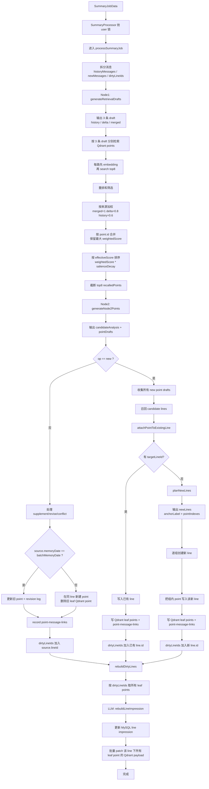

# 聊天印象任务详细流程

只描述当前代码真实执行的 `chat-summary-queue -> SummaryProcessor -> QdrantService.processSummaryJob()`。

关键代码：
- `backend/src/chat/chat.service.ts`
- `backend/src/queue/queue.service.ts`
- `worker/src/processor/summary.processor.ts`
- `worker/src/services/qdrant.service.ts`
- `worker/src/services/dashscope.service.ts`

## 1. 先回答你那 4 点是否满足

### 1）缓存结束条件

应表述为：

- 后端会在收到 `user message` 和 Dify 返回的完整 `assistant message` 后，把这两条消息都放进本地 buffer。
- buffer 的 flush 条件只有两个：
  - `2 分钟内没有新增消息`
  - `buffer 累计达到 10 条消息`
- “固定补最近 15 条历史记录”不属于缓存阶段，而属于 flush 之后构造聊天印象任务 payload 的阶段。

代码依据：
- [chat.service.ts](/home/zxr/chat_like_human/backend/src/chat/chat.service.ts:42) `FLUSH_THRESHOLD = 10`
- [chat.service.ts](/home/zxr/chat_like_human/backend/src/chat/chat.service.ts:43) `FLUSH_TIMEOUT_MS = 2 * 60 * 1000`
- [chat.service.ts](/home/zxr/chat_like_human/backend/src/chat/chat.service.ts:235) `buffer.messages.length >= FLUSH_THRESHOLD`

### 2）满足一个条件后创建两个任务

满足。

- 聊天印象任务：
  - 会固定补最近最多 `15` 条历史聊天记录
  - 然后再拼上本次全部 `newMessages`
- 用户画像抽取任务：
  - 不补历史
  - 只取本次 flush 中 `isNew !== false` 的消息

代码依据：
- [chat.service.ts](/home/zxr/chat_like_human/backend/src/chat/chat.service.ts:427) `enqueueFlushJobs()`
- [chat.service.ts](/home/zxr/chat_like_human/backend/src/chat/chat.service.ts:453) `buildSummaryPayload()`
- [queue.service.ts](/home/zxr/chat_like_human/backend/src/queue/queue.service.ts:67) 入 `chat-summary-queue`
- [queue.service.ts](/home/zxr/chat_like_human/backend/src/queue/queue.service.ts:112) 入 `chat-fact-queue`

### 3）消费者进程按任务类型执行不同逻辑

满足。

- `chat-summary-queue` -> `SummaryProcessor` -> 聊天印象链
- `chat-fact-queue` -> `FactProcessor` -> 用户画像 / 偏好链

代码依据：
- `worker/src/processor/summary.processor.ts`
- `worker/src/processor/fact.processor.ts`

### 4）你描述的聊天印象任务链路

部分满足，而且有几个关键差异。

满足的部分：
- Node1 生成检索文本
- 执行检索
- 有重排和筛选
- Node2 生成 points
- 根据 `op` 不同走不同入库逻辑
- 所有改动 line 最后都会重算 impression

不满足的部分：
- 当前主链里，`op = new` 会先召回 candidate lines，再判断是否挂已有 line。
- 但它不是“和每个相似 point 逐一做 point 级对账”，而是先把 point-level 召回结果折叠成 line candidates，再做 line 归属判断。
- 当前也不是“并发调用多个不同 LLM 节点并行投票”，而是单个 attach 节点做归属判断，没命中才进 `planNewLines()`。

代码依据：
- [qdrant.service.ts](/home/zxr/chat_like_human/worker/src/services/qdrant.service.ts:710) `processNewPointDrafts()`
- [qdrant.service.ts](/home/zxr/chat_like_human/worker/src/services/qdrant.service.ts:727) 先召回 candidate lines
- [qdrant.service.ts](/home/zxr/chat_like_human/worker/src/services/qdrant.service.ts:731) 再调用 attach 节点

## 2. 第 4 点详细版：当前真实执行链

## 2.1 文字版

### 节点 A：任务进入消费者

- 输入：
  - `SummaryJobData`
  - 字段包括：`userId`、`sessionId`、`date(batchMemoryDate)`、`batchId`、`messages`
  - 这里的 `messages = 最近最多 15 条历史 + 本次全部 newMessages`
- 内部处理：
  - `SummaryProcessor` 先按 `userId` 抢 Redis 锁，避免同一用户并发写记忆
  - 抢不到锁则把 job 延迟重试
- 输出：
  - 拿到锁后，进入 `QdrantService.processSummaryJob(data)`

### 节点 B：批次消息拆分

- 输入：
  - `data.messages`
- 内部处理：
  - `historyMessages = messages.filter(isNew === false)`
  - `newMessages = messages.filter(isNew !== false)`
  - 初始化 `dirtyLineIds = new Set()`
- 输出：
  - `historyMessages`
  - `newMessages`
  - `dirtyLineIds`

### 节点 C：Node1 检索草稿生成

- 输入：
  - 完整 `messages`
  - `recentActivatedImpressions = []`
- 内部处理：
  - 调用 `dashscopeService.generateRetrievalDrafts()`
  - LLM 输出 3 条检索草稿：
    - `historyRetrievalDraft`
    - `deltaRetrievalDraft`
    - `mergedRetrievalDraft`
  - 当前主链没有把“最近激活 impressions”补进去，传的是空数组
- 输出：
  - `RetrievalDrafts`

### 节点 D：执行检索

- 输入：
  - `userId`
  - `historyRetrievalDraft / deltaRetrievalDraft / mergedRetrievalDraft`
- 内部处理：
  - 对每一条 draft：
    - 文本非空才继续
    - 用 draft 做 embedding
    - 到 Qdrant `user_impressions` 检索 point
    - 每路最多取 `QUERY_RECALL_LIMIT = 8`
  - 这里召回的是 `point`，不是 `line`
  - Qdrant payload 里会带所属 line 的：
    - `anchorLabel`
    - `impressionLabel`
    - `impressionAbstract`
    - `lineSalienceScore`
    - `lineLastActivatedAt`
- 输出：
  - 3 路 point 检索结果

### 节点 E：检索结果重排和筛选

- 输入：
  - 3 路 point 检索结果
- 内部处理：
  - 第一步：按检索来源加权

```text
merged 权重  = 1.0
delta  权重  = 0.8
history 权重 = 0.6
weightedScore = point.relevanceScore * sourceWeight
```

  - 第二步：按 `point.id` 合并
    - 同一个 point 如果在多路命中，只保留最大 `weightedScore`
  - 第三步：计算最终排序分

```text
effectiveScore =
  weightedRelevanceScore * decayWeight

decayWeight =
  salienceScore * exp(-ln(2) * elapsedDays / 30)
```

  - 第四步：排序
    - 先按 `effectiveScore` 倒序
    - 分数相同再按 `updatedAt/createdAt` 倒序
  - 第五步：截断
    - 最终只保留 `FINAL_RECALL_LIMIT = 8` 条 old points
- 输出：
  - `recalledPoints: RetrievedMemoryPoint[]`

### 节点 F：Node2 生成 points

- 输入：
  - `historyMessages`
  - `newMessages`
  - `oldPoints = recalledPoints`
- 内部处理：
  - 调用 `dashscopeService.generateNode2Points()`
  - LLM 输出：
    - `candidateAnalysis`
    - `points[]`
  - 每个 point draft 至少包含：
    - `op`
    - `sourcePointId`
    - `text`
  - `op ∈ { new, supplement, revise, conflict }`
- 输出：
  - `node2Points`

### 节点 G：处理非 new points

- 输入：
  - `node2Points` 中 `op != new` 的 drafts
  - `recalledPoints`
  - `batchMemoryDate`
  - `newMessages`
- 内部处理：
  - 对每条 draft：
    - 必须能找到 `sourcePointId`
    - 找到 source point 后，根据 `source.memoryDate` 分两支

#### G1：同 memoryDate

- 条件：
  - `source.memoryDate === batchMemoryDate`
- 内部处理：
  - 直接更新 MySQL 里的旧 point 文本
  - 记录 `point_revision_logs`
  - 重新 upsert 这个 leaf point 到 Qdrant
  - 记录 `point-message-links`
- 输出：
  - 旧 point 被“就地改写”

#### G2：跨 memoryDate

- 条件：
  - `source.memoryDate !== batchMemoryDate`
- 内部处理：
  - 在 source 所属 `lineId` 下新建一个 point
  - `sourcePointId = source.id`
  - 从 Qdrant 删除旧 leaf point
  - 把新 point 作为新的 leaf point 写回 Qdrant
  - 记录 `point-message-links`
- 输出：
  - 同一 line 下形成新的 leaf point

#### G3：共同输出

- 内部处理：
  - 把 `source.lineId` 加入 `dirtyLineIds`
- 输出：
  - `dirtyLineIds` 被更新

### 节点 H：处理 new points

- 输入：
  - `node2Points` 中 `op = new` 的 drafts
  - `newMessages`
  - `batchMemoryDate`
- 内部处理：
  - 先对每个 `new point` 调用 `recallCandidateLines(userId, pointText)`
  - 候选 line 的来源有 3 路：
    - recent lines
    - keyword line search
    - vector points 折叠成 line
  - 每条 candidate line 都会带上：
    - `anchorLabel`
    - `impressionLabel`
    - `impressionAbstract`
    - `salienceScore`
    - `lastActivatedAt`
  - 再把 `pointText + candidateLines` 送给 `attachPointToExistingLine()`
  - 如果模型返回 `targetLineId`
    - 直接把该 point 写到已有 line
  - 如果模型返回 `null`
    - 才把该 point 放进 `unresolvedDrafts`
- 输出：
  - 已挂到已有 line 的 new points
  - `unresolvedDrafts`

### 节点 I：为 unresolved new points 规划新 line

- 输入：
  - `unresolvedDrafts`
- 内部处理：
  - 调用 `planNewLines({ pointTexts })`
  - `planNewLines()` 把多个 unresolved `new points` 分组
  - 每组生成一个新的 `anchorLabel`
- 输出：
  - `newLines[]`
  - 每个 `newLine` 包含：
    - `anchorLabel`
    - `pointIndexes`

### 节点 J：创建新 line 并写入 unresolved new points

- 输入：
  - `newLines[]`
  - `unresolvedDrafts`
- 内部处理：
  - 对每个 group：
    - 先创建一条新的 MySQL line
    - 再把 group 内每个 point draft 写成该 line 下的新 point
    - 每个 point 都会：
      - 写 MySQL point
      - 写入 Qdrant leaf point
      - 记录 `point-message-links`
    - 把这条新 `line.id` 加进 `dirtyLineIds`
- 输出：
  - 新 lines
  - 新 leaf points
  - 更新后的 `dirtyLineIds`

### 节点 K：重算所有 dirty lines 的 impression

- 输入：
  - `dirtyLineIds`
- 内部处理：
  - 对每条 dirty line：
    - 查询 line 当前所有 leaf points
    - 调用 `rebuildLineImpression({ anchorLabel, leafPoints })`
    - LLM 输出：
      - `impressionLabel`
      - `impressionAbstract`
    - 更新 MySQL line
    - 把新的 line 级字段批量回写到该 line 下所有 leaf point 的 Qdrant payload
- 输出：
  - 最新版 line impression
  - 与 line impression 对齐后的所有 leaf point payload

## 2.2 Mermaid 版



## 3. 你提到的“op=new 后再检索相似 points + 带上 impressions + 判断归属已知 line”这条链，当前到底是什么状态

当前状态是：

- 主链已经调用这两步：
  - `recallCandidateLines()`
  - `attachPointToExistingLine()`
- 但真实做法不是“point 对 point 逐一对账”，而是：
  - 先通过 recent / keyword / vector 三路把相似 point 折叠成 candidate lines
  - 每个 candidate line 会带高层 `impressionLabel / impressionAbstract`
  - 再让 attach 节点判断这个 `new point` 是否属于某个已有 line
- 所以当前真实行为是：

```text
new point -> recall candidate lines -> attach existing line? -> yes: write existing line / no: planNewLines -> create new line
```
